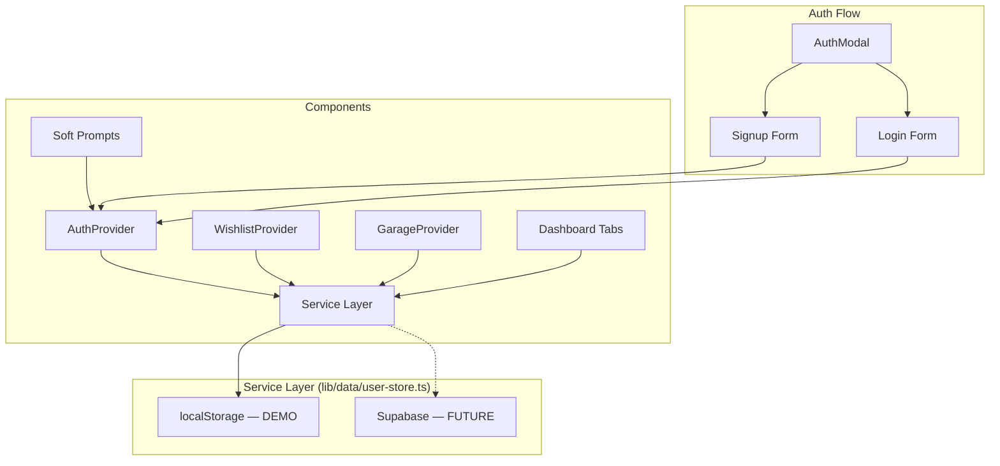

# Soft Account System & Dashboard — PROJECT SPEC

## Gate 0: Vision

**Problem:** The site has no customer account system. Checkout is guest-only, the garage is browser-locked, there's no wishlist, and appointment/order data can't be tracked by the customer. The site needs accounts to feel complete for the client demo — but account creation must never be forced.

**Users:** Customers shopping for performance parts and booking services at Turn-Key Motorsport.

**Philosophy:** Soft prompts, never hard gates. Every feature works without an account. Accounts make things *better* (persistence, tracking, wishlists), but never *required*. Guest checkout is always available.

**Success Metrics:**
- Customer can browse, shop, and check out without ever creating an account
- Soft prompts appear at 4 natural moments with appropriate UI treatment
- Account creation is 1 click when info is pre-filled (e.g., post-checkout password-only field)
- Dashboard shows saved vehicles, order history, wishlist, addresses, appointment status
- Wishlist system works end-to-end (heart icons → saved products → dashboard tab)
- All data persists via localStorage for demo phase (Supabase-ready architecture)

## Gate 1: Architecture

**Stack:** Next.js 16 (App Router), React 19, TypeScript strict, Tailwind CSS 4

**Architecture Pattern:** Service layer abstraction



**Key Architecture Decisions:**
- **Service layer pattern**: All data access goes through `lib/data/user-store.ts`. Components never touch localStorage directly for account data. Swap internals to Supabase later — zero component changes.
- **AuthProvider context**: Same interface as CartProvider/GarageProvider. Exposes `user`, `login()`, `signup()`, `logout()`, `updateUser()`. Auto-login on signup.
- **localStorage for demo**: All user data (account, orders, wishlist, addresses, appointments) persists in localStorage. Server-side uses in-memory mock data for initial renders. Comment `// DEMO: Using localStorage for persistence. Replace with Supabase.` at top of data layer.
- **Password handling**: Demo phase stores passwords with basic hashing in localStorage. NOT secure — documented in code comments. Supabase Auth handles real security later.
- **Prompt dismissal**: Track dismissed prompts in localStorage so users aren't re-prompted after dismissing. Key: `turn-key-dismissed-prompts`.
- **Pre-fill**: Signup forms pull available data from checkout info, appointment submissions, and garage vehicles. One password field when email/name already known.

**Data Model (extends existing types.ts):**

```typescript
interface AuthUser {
  id: string;
  name: string;
  email: string;
  phone: string;
  passwordHash: string;           // DEMO only — Supabase Auth handles this later
  createdAt: string;
  notificationPrefs: NotificationPreferences;
}

interface NotificationPreferences {
  orderUpdates: boolean;          // default: true
  appointmentUpdates: boolean;    // default: true
  newsletter: boolean;            // default: false
  promotions: boolean;            // default: false
}

// Existing types reused: UserAccount, SavedVehicle, Address, Order, OrderItem, GarageVehicle
// Existing types extended: UserAccount gets notificationPrefs field
```

**Auth:** Client-side AuthProvider with localStorage session. No server-side auth for demo phase. Supabase Auth replaces this later.

## Gate 2: Features

### P0 (Must Have)
- AuthProvider context with login/signup/logout/auto-login-on-signup
- Data service layer (user-store.ts) with localStorage persistence
- Email + password signup and login forms
- AuthModal component (shared by soft prompts)
- Wishlist system: WishlistProvider, heart icons on product cards, add/remove
- 4 soft prompts at natural moments:
  1. Toast after vehicle fitment selection ("Save your ride")
  2. Inline banner on checkout confirmation ("Track your order")
  3. Modal on wishlist action when not logged in ("Create account to save wishlist")
  4. Inline banner on appointment confirmation ("Check your status")
- Account dashboard with 6 tabs: Profile, Orders, Vehicles, Wishlist, Addresses, Settings
- Auth-aware header (Login link vs My Account link)
- Pre-fill signup from available context (checkout info, appointment data)
- Guest checkout always available — never gated

### P1 (Should Have)
- Prompt dismissal tracking (don't re-prompt after dismiss)
- Garage vehicle sync with account on login (merge localStorage vehicles into account)
- Saved address from checkout auto-added to account
- Change password functionality in Settings tab
- Delete account with confirmation dialog in Settings tab

### P2 (Nice to Have — NOT in this build)
- OAuth (Google/Apple sign-in)
- Email verification
- Password reset / forgot password flow
- Account-linked order status emails
- Cross-device sync (requires Supabase)

### Acceptance Criteria
1. User can browse, add to cart, and complete checkout without creating an account
2. After saving a vehicle in garage, a toast slides up offering account creation (auto-dismisses ~6s)
3. After completing checkout, an inline banner offers "set a password" with pre-filled email/name
4. Clicking wishlist heart when not logged in shows a modal prompting signup
5. After submitting an appointment, an inline banner offers account creation
6. All soft prompts can be dismissed without consequence — user continues uninterrupted
7. Signup form pre-fills name/email/phone from available context data
8. Auto-login on signup — no redundant login step
9. Dashboard Profile tab shows name, email, phone, change password, and saved vehicles
10. Dashboard Orders tab shows order history with order number, date, total, status
11. Dashboard Vehicles tab shows garage vehicles synced from localStorage
12. Dashboard Wishlist tab shows saved products with links to product pages
13. Dashboard Addresses tab shows saved shipping addresses with add/edit/remove/set-default
14. Dashboard Settings tab has notification toggles and delete account
15. Header shows "Sign In" when logged out, user icon + "My Account" when logged in
16. Dismissed prompts are not shown again (localStorage tracking)
17. All components are mobile-responsive (375px+)
18. All forms have proper validation, loading states, and error handling

## Gate 3: Implementation Plan

### Feature 1: Auth Foundation (10 files)

| # | File | Action | Size | Purpose |
|---|------|--------|------|---------|
| 1 | `lib/types.ts` | MODIFY | S | Add AuthUser, NotificationPreferences types |
| 2 | `lib/data/user-store.ts` | CREATE | L | Service layer: CRUD for users, orders, addresses, wishlist, appointments. localStorage demo persistence. |
| 3 | `lib/auth-context.tsx` | CREATE | L | AuthProvider: user state, login(), signup(), logout(), updateUser(). localStorage session. |
| 4 | `components/auth/LoginForm.tsx` | CREATE | M | Email + password login form with validation |
| 5 | `components/auth/SignupForm.tsx` | CREATE | M | Email + password signup form with pre-fill support |
| 6 | `components/auth/AuthModal.tsx` | CREATE | M | Modal wrapper with login/signup tab toggle |
| 7 | `app/login/page.tsx` | CREATE | S | Standalone login page |
| 8 | `app/signup/page.tsx` | CREATE | S | Standalone signup page |
| 9 | `app/layout.tsx` | MODIFY | S | Add AuthProvider to provider stack |
| 10 | `components/layout/Header.tsx` | MODIFY | S | Auth-aware: Sign In vs My Account |

### Feature 2: Wishlist System (5 files)

| # | File | Action | Size | Purpose |
|---|------|--------|------|---------|
| 1 | `lib/wishlist-context.tsx` | CREATE | M | WishlistProvider: add/remove/toggle/check, localStorage persistence |
| 2 | `components/shop/WishlistButton.tsx` | CREATE | S | Heart icon button — filled when in wishlist |
| 3 | `components/shop/ProductCard.tsx` | MODIFY | S | Add WishlistButton to each product card |
| 4 | `app/shop/[slug]/page.tsx` | MODIFY | S | Add WishlistButton to product detail page |
| 5 | `app/layout.tsx` | MODIFY | S | Add WishlistProvider to provider stack |

### Feature 3: Soft Account Prompts (7 files)

| # | File | Action | Size | Purpose |
|---|------|--------|------|---------|
| 1 | `lib/prompt-utils.ts` | CREATE | S | Dismissed-prompt tracking (localStorage), shouldShowPrompt() helper |
| 2 | `components/prompts/AccountToast.tsx` | CREATE | M | Slide-up toast: "Save your ride" — auto-dismiss ~6s |
| 3 | `components/prompts/AccountBanner.tsx` | CREATE | M | Inline banner: pre-filled password field or full signup |
| 4 | `components/prompts/WishlistAuthModal.tsx` | CREATE | S | Thin wrapper: triggers AuthModal when wishlist clicked while logged out |
| 5 | `lib/garage-context.tsx` | MODIFY | S | After addVehicle, emit event / set flag for toast trigger |
| 6 | `components/shop/CheckoutForm.tsx` | MODIFY | M | Add AccountBanner on confirmation screen |
| 7 | `components/schedule/ConfirmationStep.tsx` | MODIFY | M | Add AccountBanner on appointment confirmation |

### Feature 4: Account Dashboard (8 files)

| # | File | Action | Size | Purpose |
|---|------|--------|------|---------|
| 1 | `app/account/page.tsx` | MODIFY | L | Complete rewrite: client component, auth gate, tab routing |
| 2 | `components/account/AccountSidebar.tsx` | CREATE | M | Sidebar with tab navigation + sign out |
| 3 | `components/account/ProfileTab.tsx` | CREATE | M | Name, email, phone, change password, saved vehicles |
| 4 | `components/account/OrdersTab.tsx` | CREATE | M | Order history list with status badges |
| 5 | `components/account/VehiclesTab.tsx` | CREATE | M | Garage vehicles with edit nickname, remove |
| 6 | `components/account/WishlistTab.tsx` | CREATE | M | Saved products grid with remove + add-to-cart |
| 7 | `components/account/AddressesTab.tsx` | CREATE | M | Address cards with add/edit/remove/set-default |
| 8 | `components/account/SettingsTab.tsx` | CREATE | M | Notification toggles + delete account |

### Feature 5: Integration & Polish (4 files)

| # | File | Action | Size | Purpose |
|---|------|--------|------|---------|
| 1 | `components/layout/MobileNav.tsx` | MODIFY | S | Auth-aware mobile nav links |
| 2 | `lib/garage-context.tsx` | MODIFY | S | Sync garage vehicles to account on login |
| 3 | `components/shop/CheckoutForm.tsx` | MODIFY | S | Save address to account after checkout (if logged in) |
| 4 | `lib/auth-context.tsx` | MODIFY | S | On login: merge localStorage garage/wishlist into account |

**Total: 23 new files, 11 modified files = 34 files**

## Gate 4: Infrastructure

### Environment Variables
No new env vars for demo phase. Supabase will require:
```
# FUTURE — not needed for demo
NEXT_PUBLIC_SUPABASE_URL=
NEXT_PUBLIC_SUPABASE_ANON_KEY=
SUPABASE_SERVICE_ROLE_KEY=
```

### Services
- No new services for demo phase
- Future: Supabase (Auth + PostgreSQL)

### localStorage Keys (demo phase)
```
turn-key-auth-user        — Current logged-in user session
turn-key-users            — All registered users (demo only)
turn-key-wishlist         — Wishlist product IDs
turn-key-dismissed-prompts — Array of dismissed prompt IDs
turn-key-user-orders      — Order history per user
turn-key-user-addresses   — Saved addresses per user
turn-key-user-appointments — Linked appointment references per user
```

### Hosting: No changes — Vercel deployment unchanged.

## Gate 5: Launch Checklist
- [ ] Guest checkout works end-to-end without account — no gates, no friction
- [ ] All 4 soft prompts appear at correct moments with correct UI treatment
- [ ] All prompts dismissible — no forced account creation anywhere
- [ ] Signup pre-fills from available context (checkout email/name, appointment data)
- [ ] Auto-login on signup — no redundant login step
- [ ] Wishlist heart icons on all product cards and product detail pages
- [ ] Dashboard loads with real data from localStorage (vehicles, orders, wishlist, addresses)
- [ ] Profile tab: edit name/email/phone, change password, view vehicles
- [ ] Settings tab: notification toggles save, delete account works with confirmation
- [ ] Header shows correct auth state (Sign In vs My Account)
- [ ] Mobile responsive: all forms, dashboard, and prompts work on 375px+
- [ ] WCAG AA: form labels, ARIA attributes, keyboard navigation, focus management
- [ ] No TypeScript errors — strict mode, no `any`
- [ ] Service layer has `// DEMO` comments marking all localStorage code for Supabase swap
- [ ] Dismissed prompts tracked — not re-shown after dismissal
- [ ] Password stored with basic hash — code comments flag this as demo-only
- [ ] Data layer is clean abstraction — components never touch localStorage directly for account data
