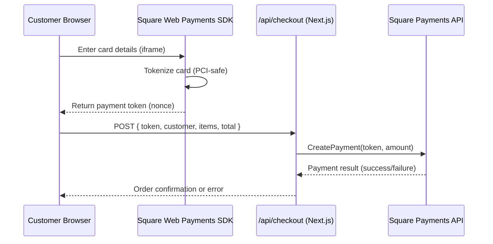

# Square Web Payments Integration — PROJECT SPEC

## Gate 0: Vision
**Problem:** The checkout flow is placeholder-only — no real payment processing. Customers can fill out the form but no money changes hands. The business cannot sell parts online.

**Users:** Customers purchasing performance parts through the Turn-Key Motorsport e-commerce shop.

**Success Metrics:**
- Customer can enter a credit/debit card and complete a real payment
- Sandbox mode works end-to-end with Square test cards
- Switching to production requires only changing env vars (no code changes)
- Payment errors (declined, expired, network) show clear messages and preserve form data

## Gate 1: Architecture

**Stack:** Next.js 16 (App Router), React 19, TypeScript strict, Tailwind CSS 4, Square Web Payments SDK

**Integration Flow:**


**Key Architecture Decisions:**
- Square SDK renders card fields in an iframe — card numbers NEVER touch our server (PCI DSS compliant)
- The browser gets a one-time-use token (nonce) — that's what we send to our API
- Our API route calls Square's server-side SDK to actually charge the card
- Amount is calculated server-side (never trust the client's total)

**Data Model:** No database changes. Orders exist only in Square's dashboard (Option A).

**Auth:** No auth required — public checkout endpoint (same as current).

## Gate 2: Features

### P0 (Must Have)
- Square Web Payments SDK card form embedded in checkout page
- Server-side payment processing via Square Node.js SDK
- Sandbox mode by default (env var toggle)
- Clear error messages for payment failures (declined, expired, network)
- Form data preserved on payment failure (only card re-entry needed)
- Server-side total recalculation (don't trust client amount)
- Order confirmation with Square transaction ID

### P1 (Should Have)
- Loading states during tokenization and payment processing
- Card brand detection icon (Visa, MC, Amex, Discover)
- Input validation on card fields (via SDK built-in)

### P2 (Nice to Have — NOT in this build)
- Apple Pay / Google Pay
- Afterpay
- Order confirmation emails
- Database storage for orders

### Acceptance Criteria
1. Customer can complete payment with Square sandbox test card `4111 1111 1111 1111`
2. Declined card shows user-friendly error
3. Form data (name, address, email) persists after payment failure
4. Payment amount matches server-calculated total (not client-sent total)
5. No card data touches the Next.js server (SDK iframe handles it)
6. Switching to production = changing env vars only
7. Checkout UI matches existing design system (dark theme, Tailwind classes)
8. Mobile-responsive card form

## Gate 3: Implementation Plan

### Files to create/modify (dependency order):

| # | File | Action | Complexity | Purpose |
|---|------|--------|------------|---------|
| 1 | `.env.example` | MODIFY | S | Add Square env vars |
| 2 | `lib/square.ts` | CREATE | S | Server-side Square client initialization |
| 3 | `components/shop/SquareCardForm.tsx` | CREATE | L | Client component — loads SDK, renders card iframe, handles tokenization |
| 4 | `app/api/checkout/route.ts` | CREATE | M | New API route — receives token, calls Square CreatePayment |
| 5 | `components/shop/CheckoutForm.tsx` | MODIFY | L | Replace placeholder payment section with SquareCardForm, wire up submission flow |
| 6 | `app/layout.tsx` | MODIFY | S | Add Square Web Payments SDK script tag |

**Total: 3 modified, 3 new = 6 files**

## Gate 4: Infrastructure

### Environment Variables (add to `.env.local`):
```
NEXT_PUBLIC_SQUARE_APP_ID=sandbox-sq0idb-XXXXX
NEXT_PUBLIC_SQUARE_LOCATION_ID=LXXXXX
SQUARE_ACCESS_TOKEN=EAAAl...sandbox token
SQUARE_ENVIRONMENT=sandbox
```

**Sandbox → Production switch:**
1. Change `NEXT_PUBLIC_SQUARE_APP_ID` to production app ID
2. Change `NEXT_PUBLIC_SQUARE_LOCATION_ID` to production location ID
3. Change `SQUARE_ACCESS_TOKEN` to production access token
4. Change `SQUARE_ENVIRONMENT` to `production`

### Services:
- Square Developer Account (free)
- Square Web Payments SDK (loaded via CDN script tag)
- `square` npm package (server-side SDK)

### Hosting: No changes — Vercel deployment stays the same.

## Gate 5: Launch Checklist
- [ ] PCI: Card data never reaches server (SDK iframe only)
- [ ] Security: Access token is server-side only (no NEXT_PUBLIC_ prefix)
- [ ] Security: Server recalculates total from cart items (never trusts client)
- [ ] Security: API validates all input with Zod
- [ ] UX: Error messages are user-friendly (no raw Square error codes)
- [ ] UX: Loading spinner during payment processing
- [ ] UX: Form data preserved on payment failure
- [ ] Mobile: Card form responsive on 375px+
- [ ] WCAG: Card form labels and ARIA attributes
- [ ] Sandbox: Test card 4111 1111 1111 1111 processes successfully
- [ ] Sandbox: Declined card shows proper error
- [ ] Env: .env.example updated with all Square vars
- [ ] Env: Production switch requires only env var changes
